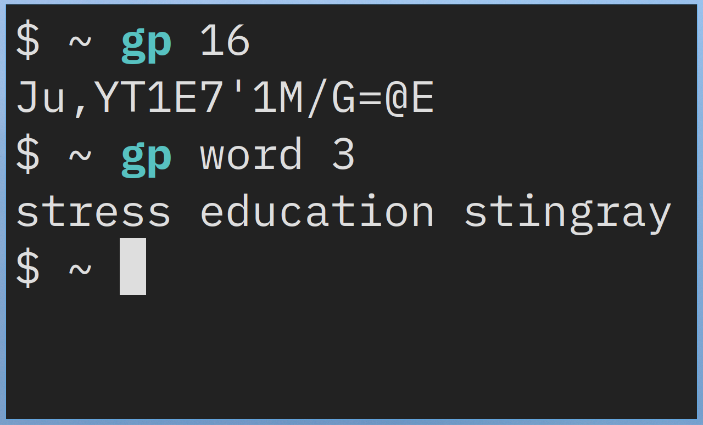

# gp

## Setup
- First, copy the `eff_large_wordlist.txt` into `~/.local/share/` if you want to be able to generate passphrases.
- Then just make the script executable with `chmod +x gp` and put it in your path. (preferably `~/.local/bin/`).
## Usage
### Generate password with length k
```sh
gp k
```
### Generate passphrase with length k
```sh
gp word k
```
